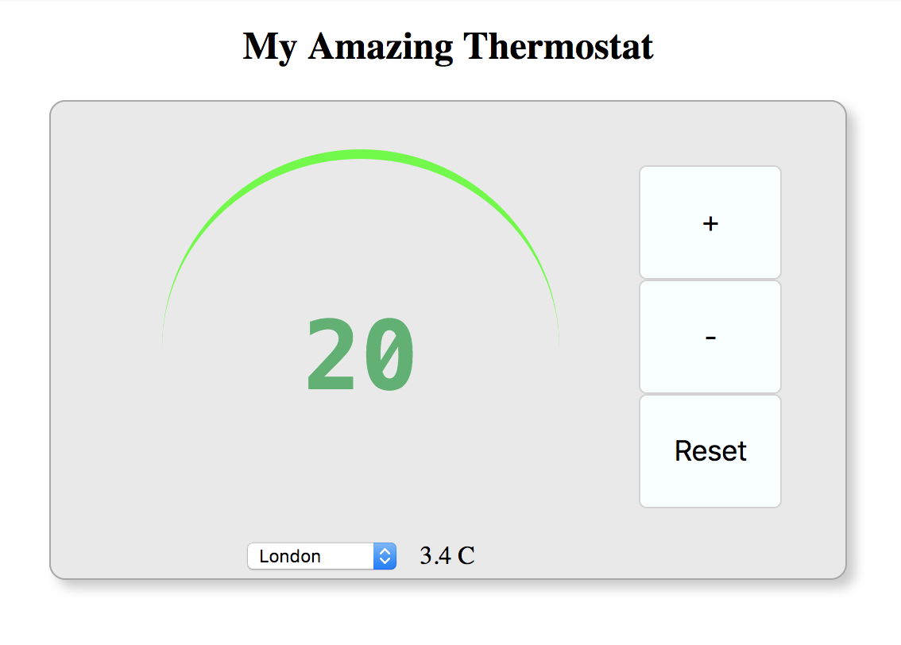

## Simple thermostat

Create a thermostat that can
- display a temperature value
- increase / decrease the tempereature
- reset the temperature to a default value
- limit the temperature range to be between 10 an 32 C
- change colour of the displayed temperature for 3 different temperature ranges:
    - 10 <= temp < 15 **blue**
    - 15 <= temp < 23 **green**
    - 23 <= temp **red**
- integrates a 3rd party API to display current weather information (temp in metrics unit) of 3 cities that can be choosen from a drop down list

